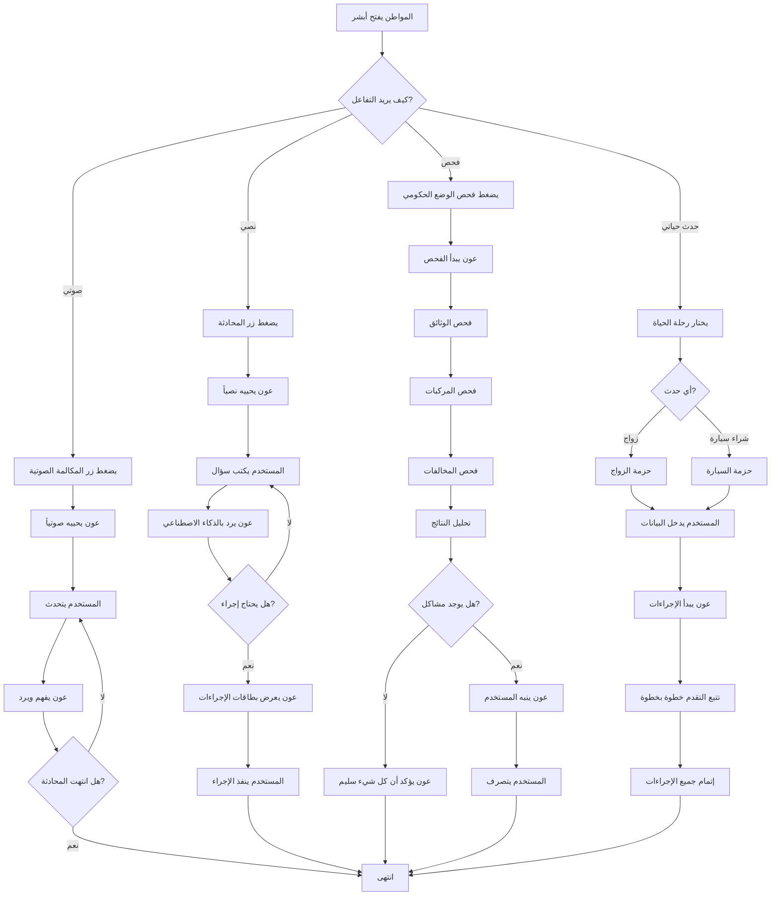
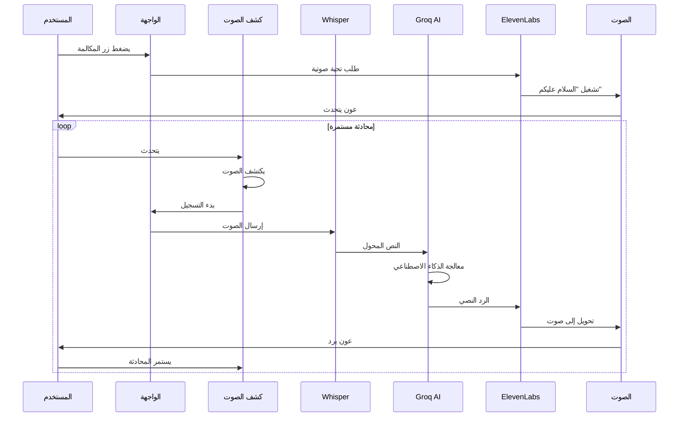
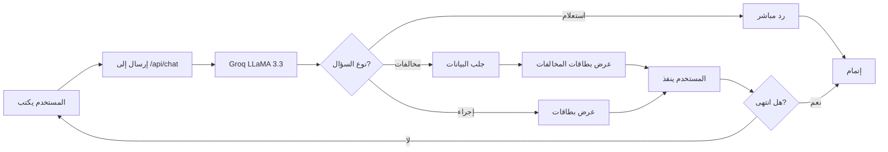
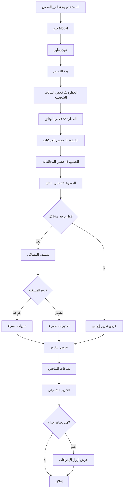
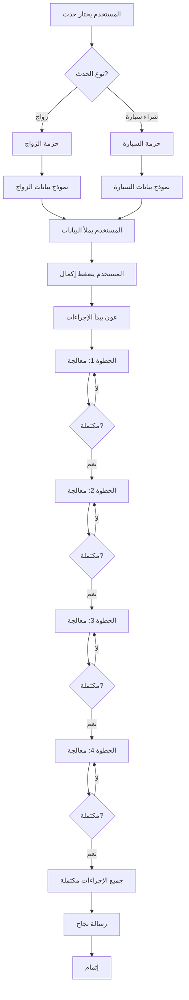
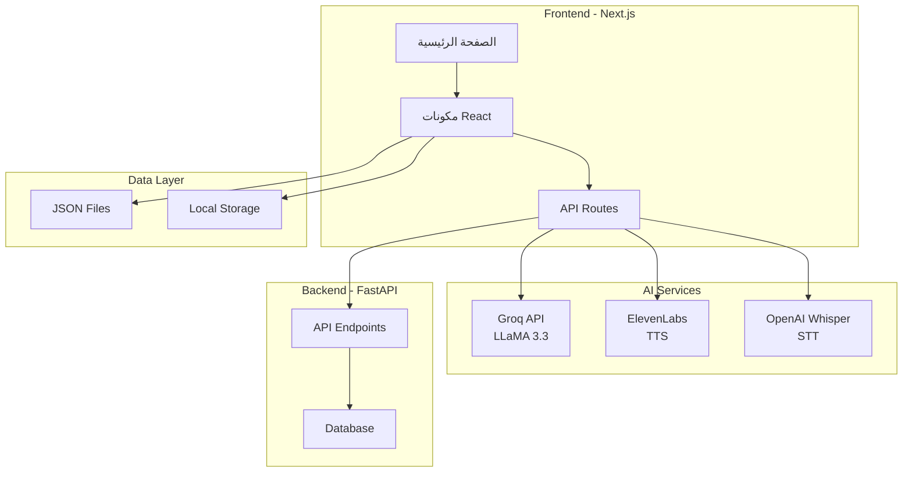
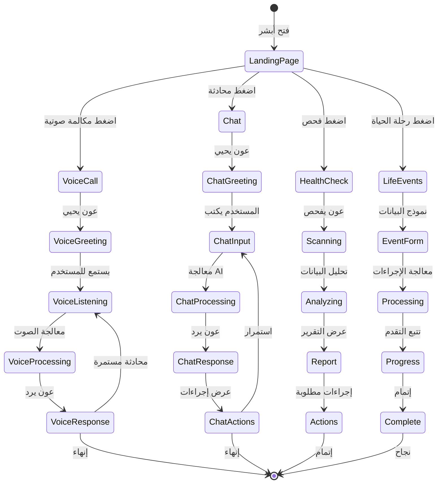
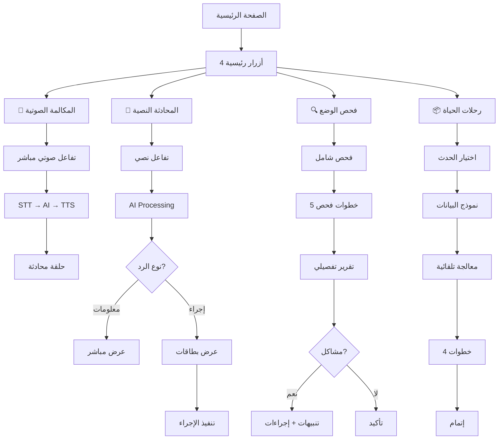

# 🇸🇦 عون - المساعد الذكي للخدمات الحكومية

<div align="center">


# **عون (Aoun)**

## المساعد الذكي الذي يجعل الخدمات الحكومية أسهل وأذكى

**مشروع مقدم لـ Absher Hackathon 2025**

[](https://nextjs.org/)
[](https://www.typescriptlang.org/)
[](https://groq.com/)

</div>

---

## 🎯 المشكلة التي نحلها

### التحديات الحالية:

- ❌ **تعقيد الإجراءات**: المواطن يحتاج لزيارة عدة مواقع لإتمام إجراء واحد
- ❌ **عدم الوعي**: المواطن لا يعرف متى تنتهي وثائقه أو تأمينه حتى يصبح غرامة
- ❌ **وقت طويل**: إتمام الإجراءات الحكومية يستغرق ساعات أو أيام
- ❌ **صعوبة الوصول**: الخدمات الحكومية غير موحدة في مكان واحد

---

## 💡 الحل المبتكر: عون

**عون** هو مساعد ذكي متكامل يجمع جميع الخدمات الحكومية في مكان واحد، ويتفاعل مع المواطن بالصوت والنص، و**ينبهه قبل أن تصبح غرامة**.

### 🚀 المميزات الرئيسية:

#### 1️⃣ **المساعد الصوتي الذكي** 🎤

```
┌─────────────────────────────────────┐
│  المستخدم يتحدث → عون يفهم         │
│  عون يرد بصوت عربي طبيعي           │
│  محادثة مستمرة بدون توقف            │
└─────────────────────────────────────┘
```

- **تفاعل صوتي كامل**: تحدث مع عون بالعربية، ويرد عليك بصوت طبيعي
- **فهم ذكي**: يفهم نيتك حتى لو لم تكن دقيقاً في السؤال
- **لا حاجة للكتابة**: مثالي لكبار السن والأشخاص ذوي الإعاقة

#### 2️⃣ **فحص الوضع الحكومي الكامل** 🔍

```
┌─────────────────────────────────────┐
│  عون يفحص:                           │
│  ✅ الوثائق (هوية، رخصة)            │
│  ✅ المركبات والتأمين                │
│  ✅ المخالفات والغرامات              │
│  ⚠️  تنبيهات قبل أن تصبح غرامة      │
└─────────────────────────────────────┘
```

- **فحص شامل**: جميع خدماتك الحكومية في مكان واحد
- **تنبيهات ذكية**: ينبهك قبل انتهاء وثائقك بـ 10 أيام
- **تقرير تفصيلي**: يعرض لك كل شيء يحتاج إجراء فوري

#### 3️⃣ **رحلات الحياة** 📦

```
┌─────────────────────────────────────┐
│  حدث حياتك → عون يجهز كل شيء        │
│                                      │
│  💍 الزواج:                         │
│     • تحديث الحالة الاجتماعية       │
│     • ربط السجلات                   │
│     • تحديث بيانات الأسرة           │
│                                      │
│  🚗 شراء سيارة:                     │
│     • نقل الملكية                   │
│     • تحديث التأمين                 │
│     • تسجيل المركبة                 │
└─────────────────────────────────────┘
```

- **حزم جاهزة**: حدث حياتك (زواج، شراء سيارة) → عون يجهز كل الإجراءات
- **خطوة واحدة**: بدلاً من زيارة 5 مواقع، اضغط زر واحد
- **تتبع مرئي**: شاهد تقدم الإجراءات خطوة بخطوة

#### 4️⃣ **المحادثة الذكية** 💬

- **أسئلة طبيعية**: "ما هي مخالفاتي؟" → عون يفهم ويرد
- **إجراءات سريعة**: "أريد سداد المخالفة" → عون يساعدك مباشرة
- **فهم السياق**: يتذكر محادثتك السابقة

---

## 🎨 واجهة مستخدم احترافية

### التصميم:

- ✅ **حكومي ومهني**: تصميم يليق بمنصة حكومية
- ✅ **سهل الاستخدام**: واجهة بسيطة وواضحة
- ✅ **متجاوب**: يعمل على جميع الأجهزة
- ✅ **عربي بالكامل**: RTL محسّن للعربية

### الألوان:

- **أخضر داكن** (#00663D): لون أبشر الرسمي
- **أبيض ورمادي**: خلفيات مريحة للعين
- **ألوان محدودة**: تصميم حكومي نظيف

---

## 🛠️ التقنيات المستخدمة

---

## 🤖 AI models 

| التقنية                 | الوصف                                              |
| ------------------------------ | ------------------------------------------------------- |
| **Groq LLaMA 3.3 (70B)** | للفهم الطبيعي والردود الذكية   |
| **OpenAI Whisper**       | لتحويل الصوت إلى نص (عربي)          |
| **ElevenLabs**           | لتحويل النص إلى صوت عربي طبيعي |

## 🧠 Agentic System

| المكون                   | الوظيفة                                            |
| ------------------------------ | --------------------------------------------------------- |
| **LangGraph**            | Workflow orchestration                                    |
| **Autonomous Execution** | Tool execution تلقائي                               |
| **Service Selection**    | اختيار الخدمة + تخطيط الإجراءات |
| **RAG Pipeline**         | Context-aware reasoning                                   |
| **State Machine**        | State-based decision making                               |
| **Error Handling**       | معالجة الأخطاء والبدائل              |

## 🛠️ التطوير

### Frontend

| التقنية         | الوصف                         |
| ---------------------- | ---------------------------------- |
| **Next.js 15**   | Framework حديث وسريع      |
| **TypeScript**   | كود آمن ومنظم           |
| **Tailwind CSS** | تصميم سريع ومتجاوب |

### Backend

| التقنية               | الوصف                                     |
| ---------------------------- | ---------------------------------------------- |
| **FastAPI (Python)**   | REST API سريع وقوي                     |
| **LangGraph**          | Agent workflow orchestration                   |
| **Groq LPU Inference** | استدلال سريع للنماذج         |
| **RAG Pipeline**       | استرجاع المعرفة السياقية |
| **Tooling Layer**      | طبقة الأدوات والتنفيذ       |
| **Vector DB**          | Pinecone / Weaviate للبحث الدلالي  |

## 📊 الأثر المتوقع

### للمواطن:

- ⏱️ **توفير الوقت**: من ساعات إلى دقائق
- 💰 **توفير المال**: تجنب الغرامات بالتنبيهات المبكرة
- 😊 **راحة البال**: كل شيء في مكان واحد
- ♿ **سهولة الوصول**: صوتي للمكفوفين وكبار السن

### للحكومة:

- 📈 **تقليل الزيارات**: المواطن لا يحتاج زيارة المكاتب
- 💼 **كفاءة أعلى**: تقليل العبء على الموظفين
- 📊 **بيانات أفضل**: فهم احتياجات المواطنين
- 🎯 **رضا المواطن**: تجربة أفضل = رضا أعلى

---

## 📊 User Flow Diagrams

### 🎯 User Journey - رحلة المستخدم الكاملة



### 🎤 Voice Agent Workflow - تدفق المساعد الصوتي



### 💬 Chat Workflow - تدفق المحادثة النصية



### 🔍 Health Check Workflow - تدفق فحص الوضع الحكومي



### 📦 Life Event Bundle Workflow - تدفق رحلات الحياة



### 🏗️ System Architecture - البنية التقنية



### 🔄 Complete User Flow - التدفق الكامل



### 🎯 Feature Interaction Flow - تفاعل الميزات



## 🎬 Demo Scenarios

### السيناريو 1: فحص الوضع الحكومي

```
1. المواطن يضغط "فحص وضعك الحكومي"
2. عون يفحص جميع بياناته
3. عون ينبهه: "هويتك تنتهي خلال 10 أيام!"
4. عون يعرض تقرير شامل
5. المواطن يتصرف قبل أن تصبح غرامة ✅
```

### السيناريو 2: محادثة صوتية

```
1. المواطن يضغط زر المكالمة الصوتية
2. عون: "السلام عليكم، كيف أقدر أساعدك؟"
3. المواطن: "ما هي مخالفاتي؟"
4. عون: "لديك 3 مخالفات بمبلغ 950 ريال..."
5. محادثة مستمرة بدون توقف 🎤
```

### السيناريو 3: رحلة الحياة (الزواج)

```
1. المواطن يختار "حزمة الزواج"
2. يدخل بيانات الزواج
3. عون يبدأ الإجراءات:
   • تحديث الحالة الاجتماعية ✅
   • ربط السجلات ✅
   • تحديث بيانات الأسرة ✅
4. كل شيء مكتمل في دقائق! 🎉
```

---

## 🏆 الابتكارات الرئيسية

### 1. **التنبيهات الذكية**

- عون **ينبهك قبل** أن تصبح غرامة
- يحسب الأيام المتبقية تلقائياً
- يعطيك أولويات واضحة

### 2. **التفاعل الصوتي الكامل**

- أول مساعد حكومي صوتي بالعربية
- محادثة طبيعية بدون توقف
- مناسب لجميع الفئات

### 3. **حزم الأحداث الحياتية**

- حدث حياتك → عون يجهز كل شيء
- بدلاً من 5 مواقع، زر واحد
- تتبع مرئي للتقدم

### 4. **التكامل الشامل**

- جميع الخدمات في مكان واحد
- بيانات موحدة من مصادر مختلفة
- تجربة سلسة بدون تعقيد

---

## 📈 الإحصائيات

```
┌─────────────────────────────────────┐
│  الملفات: 150+                      │
│  الأسطر: 15,000+                    │
│  المكونات: 20+                      │
│  الميزات: 6+                        │
│  API Routes: 5+                     │
└─────────────────────────────────────┘
```

---

## 🎯 القيمة المضافة

### للمواطن:

- ✅ **سهولة**: كل شيء في مكان واحد
- ✅ **سرعة**: إجراءات في دقائق
- ✅ **ذكاء**: عون يفهم نيتك
- ✅ **راحة**: صوتي ونصي

### للحكومة:

- ✅ **كفاءة**: تقليل العبء
- ✅ **بيانات**: فهم أفضل للاحتياجات
- ✅ **رضا**: تجربة أفضل
- ✅ **ابتكار**: تقنية حديثة

---

## 🚀 Quick Start

### للتجربة السريعة:

```bash
# 1. Clone
git clone https://github.com/ZiyadALharbi/Absher-Kackathon.git

# 2. Install
cd front-end/clone-website-ui
npm install

# 3. Setup .env.local (انظر .env.example)

# 4. Run
npm run dev

# 5. Open
http://localhost:3000
```

**للتفاصيل الكاملة:** راجع قسم "البدء السريع" في README

---

## 🎨 Screenshots

### الصفحة الرئيسية:

- زر فحص الوضع الحكومي
- رحلات الحياة
- أزرار المحادثة الصوتية والنصية

### واجهة الفحص:

- عون يفحص المعلومات
- تقرير شامل مع تنبيهات
- بطاقات ملخص

### المحادثة:

- تفاعل طبيعي مع عون
- إجراءات سريعة
- عرض البيانات

---

## 🏅 Why This Project?

### 1. **حل حقيقي لمشكلة حقيقية**

- المشكلة: تعقيد الإجراءات الحكومية
- الحل: عون يجمع كل شيء في مكان واحد

### 2. **تقنية حديثة**

- AI متقدم (Groq LLaMA 3.3)
- صوتي بالعربية
- واجهة حديثة

### 3. **سهولة الاستخدام**

- لا يحتاج تدريب
- مناسب لجميع الفئات
- صوتي ونصي

### 4. **أثر إيجابي**

- توفير الوقت والمال
- تجنب الغرامات
- رضا المواطن

---

## 👥 الفريق

تم التطوير بـ ❤️ لصالح:

- **وزارة الداخلية** - المملكة العربية السعودية
- **رؤية 2030** - التحول الرقمي

---

## 📞 Contact

**GitHub:** https://github.com/ZiyadALharbi/Absher-Kackathon

---

<div align="center">

# **عون - جعل الخدمات الحكومية أسهل**

**صُنع بـ ❤️ للمملكة العربية السعودية 🇸🇦**

**رؤية 2030 | التحول الرقمي | خدمة المواطن**

</div>
